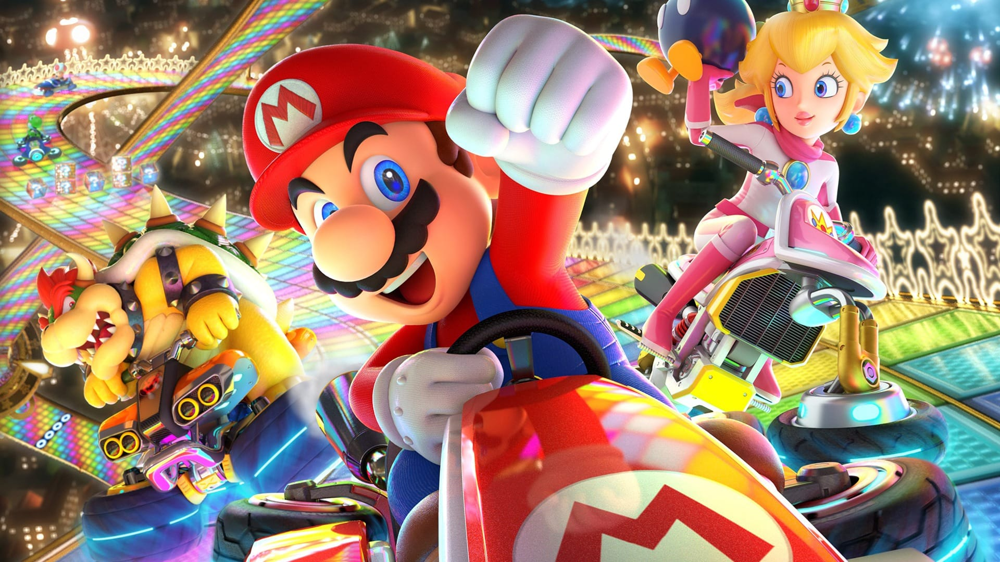
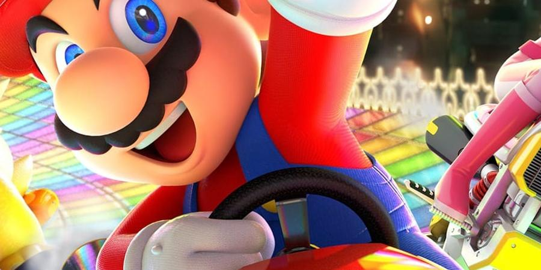
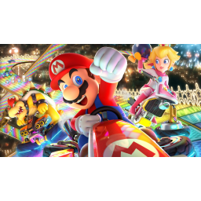
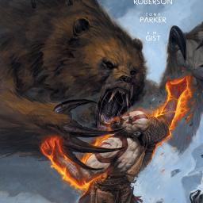
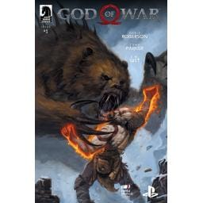
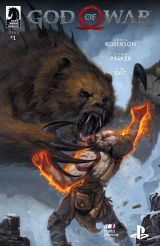

# Java Image Resizer Utility

## Original Image

## Square from Center (256px)

## Resize from Center (900px x 450px)

## Square with Background Color (256px)

## Square with Transparent Background (256px)

## Fixed Width (150px)

## Fixed Height (400px)

## Resize in % (25%)

## Stretched Image (256px)

## Original Image

## Square from Center (256px)

## Resize from Center (900px x 450px)

## Square with Background Color (256px)

## Square with Transparent Background (256px)

## Fixed Width (150px)

## Fixed Height (400px)

## Resize in % (25%)

## Stretched Image (256px)

